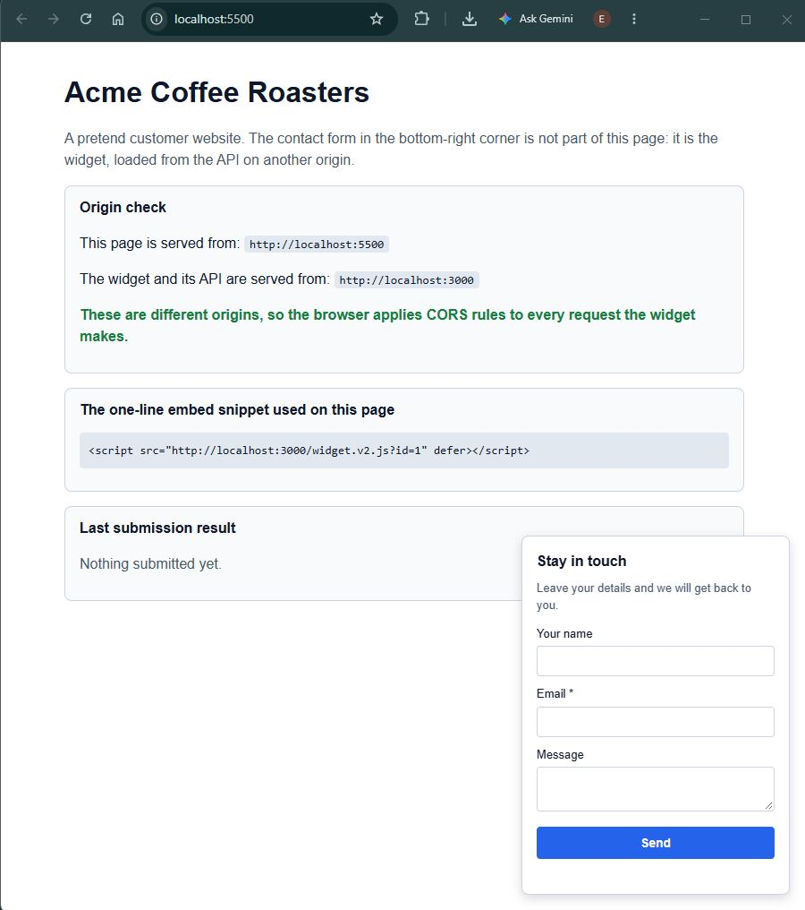
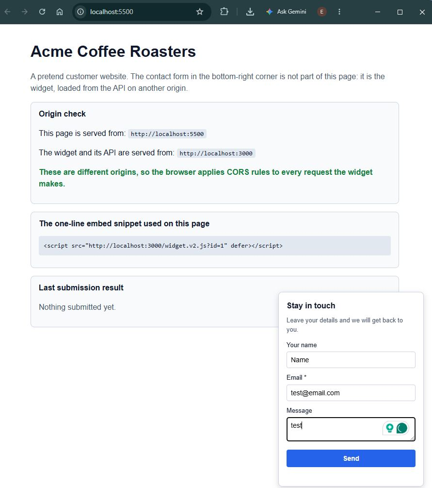
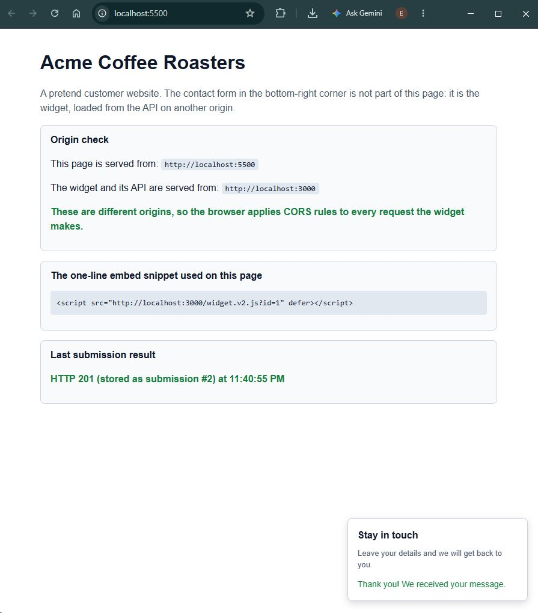
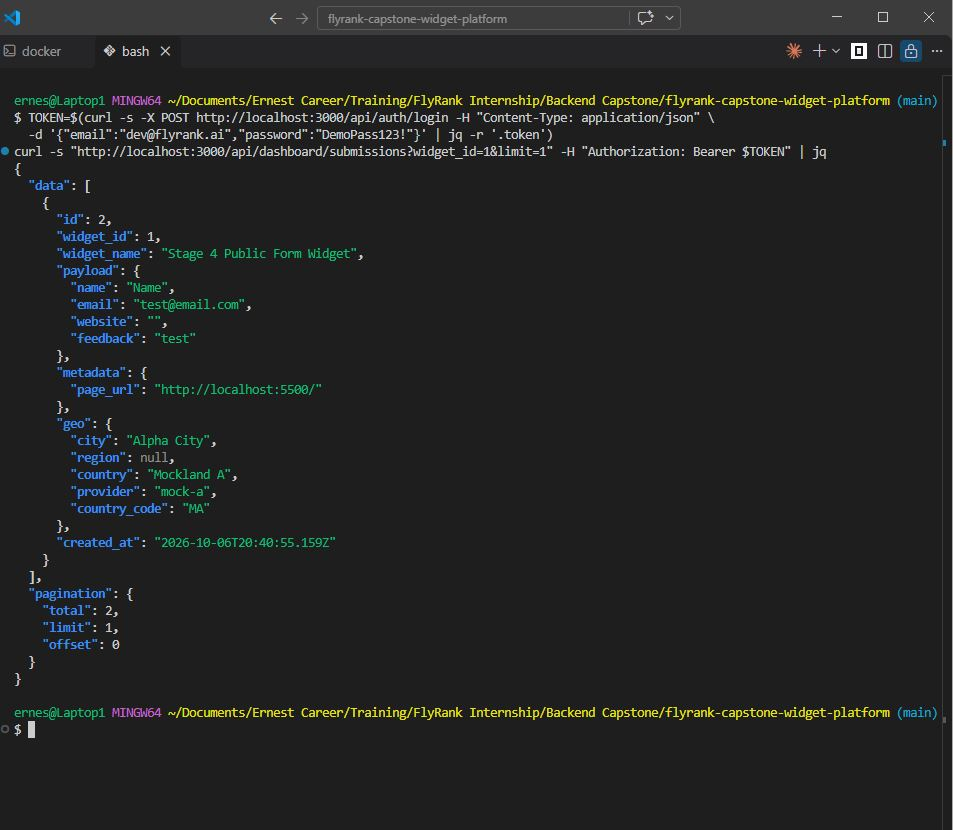
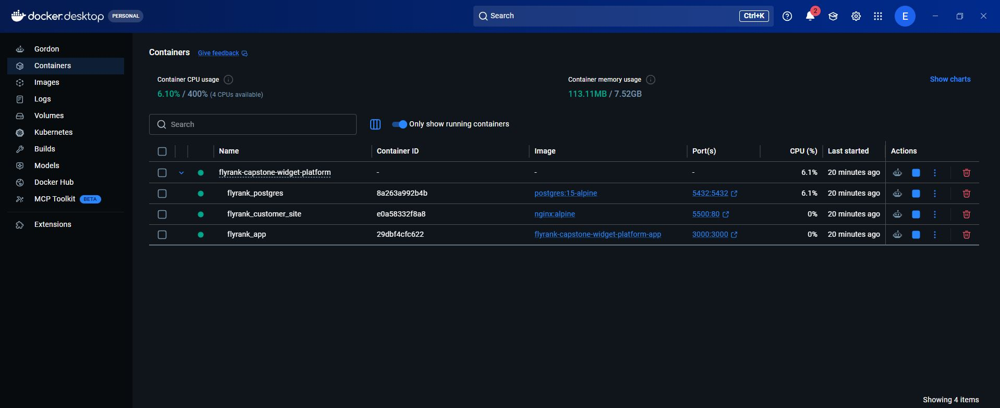
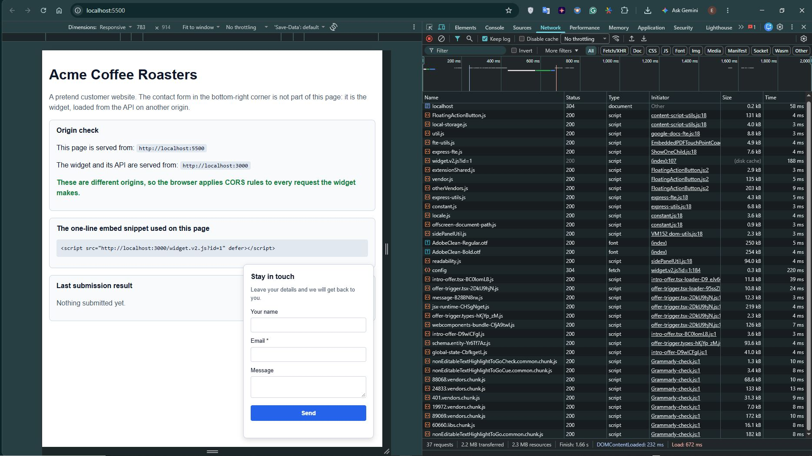
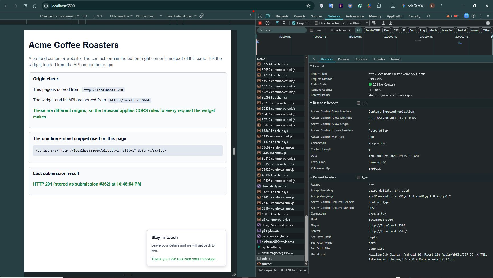
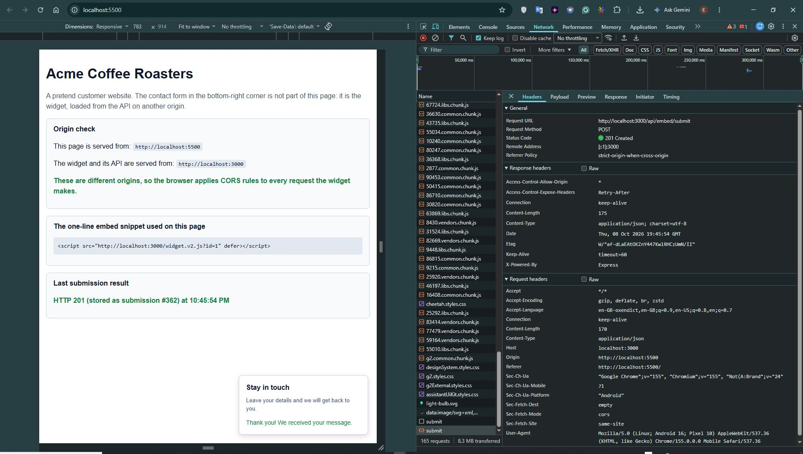

# FlyRank Capstone - Evidence Log

Every proof below is raw terminal output from a real run: Git Bash on Windows with Docker Desktop, started with `docker compose up --build`, against the PostgreSQL 15 container. Nothing is edited except that the shell prompt lines and Docker's "`version` is obsolete" warning were removed, and the output of each script is shown under its own heading.

**Run date:** 2026-10-02 for the seed step and Stages 1 and 2. Stage 4 was re-run after the JSON error handler was added, and Stage 3 was re-run after the loader-safety test (Suite 6) was added.
Stage 5 was run afterwards on the same Docker stack, and Stage 6 after that, on a database reset with `docker compose down -v`. The Stage 7 browser proof below was captured in Chrome on Windows with Docker Desktop, on a database reset the same way.
**Stages covered:** 1 to 7

The earlier version of this file was replaced. It predated the authentication fix, showed a mock token (`tenant_alpha_token_123`) and presented hand-formatted tables rather than raw output, so it no longer matched the code or the test scripts.

---

## Evidence index

| Requirement (brief, Section 6) | Proof in this file |
|---|---|
| Authenticated CRUD endpoints for widgets; requests without valid auth are rejected | [Stage 1](#stage-1-widget-management-api): sections 3, 4, 5 and 8 |
| Multi-tenant isolation (tenant A cannot read or modify tenant B's widgets or submissions) | Widgets: [Stage 1](#stage-1-widget-management-api), section 7. Submissions: [Stage 6](#stage-6-owner-dashboard-api), Test Suite 3 |
| Embed snippet generated per widget | [Stage 2](#stage-2-embed-snippet-generation) |
| Public config endpoint with correct HTTP cache headers | [Stage 3](#stage-3-fast-cached-widget-delivery): Test Suites 2 to 4 |
| Widget JavaScript served as a versioned bundle (new version = new URL) | [Stage 3](#stage-3-fast-cached-widget-delivery): Test Suites 1 and 5. Version 2 with version 1 still served: [Stage 7](#stage-7-second-origin-customer-site-and-widget-form-real-browser), Test Suite 2 and screenshot 6 |
| Cross-origin submissions work; CORS and preflight handled | [Stage 4](#stage-4-public-submission-endpoint): Tests 1 and 2 |
| Input validated; malformed and oversized payloads rejected with 4xx and JSON errors | [Stage 4](#stage-4-public-submission-endpoint): Tests 3, 4, 5, 6 and 7 |
| Valid submissions stored safely, linked to the right widget and tenant | [Stage 4](#stage-4-public-submission-endpoint): Test 2 and the database query below it |
| Rate limiting per IP and/or per widget returns 429 under a burst, and the API keeps serving legitimate traffic | [Stage 5](#stage-5-protection-enrichment-and-safe-side-effects): Test Suites 4 and 5 |
| At least one spam-prevention technique demonstrably blocks a spam submission | [Stage 5](#stage-5-protection-enrichment-and-safe-side-effects): Test Suite 1 (honeypot) |
| IP-to-geo enrichment uses a provider fallback chain; all providers down still stores the submission without geo | [Stage 5](#stage-5-protection-enrichment-and-safe-side-effects): Test Suite 2 |
| A failing confirmation email does not prevent the submission from being stored | [Stage 5](#stage-5-protection-enrichment-and-safe-side-effects): Test Suite 3 |
| The authenticated owner views their submissions with basic analytics (counts over time, per-widget stats, geo breakdown) | [Stage 6](#stage-6-owner-dashboard-api): Test Suites 2 and 4 |
| A valid submission is stored, returns 2xx and is visible via the dashboard API | `curl`: [Stage 6](#stage-6-owner-dashboard-api), Test Suite 5. Real browser on a second origin: [Stage 7](#stage-7-second-origin-customer-site-and-widget-form-real-browser), screenshots 2 to 4 |
| The widget renders on a page served from a different origin than the API | [Stage 7](#stage-7-second-origin-customer-site-and-widget-form-real-browser): screenshots 1 and 5 |
| Cross-origin submissions work: CORS headers correct, preflight (`OPTIONS`) handled | [Stage 7](#stage-7-second-origin-customer-site-and-widget-form-real-browser): screenshots 2 and 3 (real submission from another origin), screenshots 7 and 8 (the `OPTIONS` 204 and the `POST` 201 with their CORS headers in the browser's Network tab), and Test Suite 3 of `test_stage_7.sh` |

Notes:
- Tenant isolation of widgets (read, update, delete) is shown in Stage 1. Tenant isolation of submissions (list, fetch by id, filter by another owner's widget, statistics) is shown in Stage 6.
- The Stage 6 "visible via the dashboard API" proof posts the submission with `curl`. The Stage 7 proof uses a real browser on a page from a second origin.

---

## Seed step

**Command** (the `seed:` line in `capstone.yaml`):

```
$ docker compose exec -T postgres psql -U postgres -d flyrank_db < schema.sql
DROP TABLE
DROP TABLE
DROP TABLE
CREATE TABLE
CREATE TABLE
CREATE TABLE
INSERT 0 1
INSERT 0 1
 setval 
--------
      1
(1 row)

 setval 
--------
      1
(1 row)

CREATE INDEX
CREATE INDEX
CREATE INDEX
```

---

## Stage 1: Widget management API

**Command:** `bash test_stage_1.sh`
**Result:** every check passed (19 PASS lines, no FAIL).

```
==================================================
Starting Stage 1 Test Suite against http://localhost:3000
==================================================

1. Registering Tenant A...
[PASS] Tenant A Registration (Status: 201)
[PASS] Duplicate Registration Rejected (Status: 409)
[PASS] Short Password Rejected (Status: 400)

2. Logging in Tenant A...
[PASS] Tenant A Login (Status: 200)
[PASS] Wrong Password Rejected (Status: 401)

3. Testing that invalid authentication is rejected...
[PASS] No Authorization Header Rejected (Status: 401)
[PASS] Made-Up Bearer String Rejected (Status: 401)
[PASS] x-tenant-id Header Rejected (Status: 401)
[PASS] Tampered Token Rejected (Status: 401)

4. Creating Widget as Tenant A...
[PASS] Create Widget (Tenant A) (Status: 201)

5. Fetching and updating Widgets for Tenant A...
[PASS] Fetch Widgets (Tenant A) (Status: 200)
[PASS] Update Widget (Tenant A) (Status: 200)
[PASS] Updated name is returned (Name: Renamed By Tenant A)

6. Registering & Logging in Tenant B...

7. Testing Multi-Tenant Isolation (Tenant B attacking Tenant A's Widget)...
[PASS] Tenant B cannot READ Tenant A's widget (Status: 404)
[PASS] Tenant B cannot UPDATE Tenant A's widget (Status: 404)
[PASS] Tenant B cannot DELETE Tenant A's widget (Status: 404)
[PASS] Widget survived Tenant B's attacks unchanged (Name: Renamed By Tenant A)

8. Deleting Widget as Tenant A...
[PASS] Delete Widget (Tenant A) (Status: 200)
[PASS] Deleted Widget Is Gone (Status: 404)

==================================================
ALL STAGE 1 TESTS PASSED SUCCESSFULLY!
==================================================
```

---

## Stage 2: Embed snippet generation

**Command:** `bash test_stage_2.sh`
**Result:** all checks passed. The snippet points at the versioned bundle URL introduced in Stage 3.

```
==========================================================
RUNNING STAGE 2 VERIFICATION: Embed Snippet Generation
==========================================================

[Test 1] Creating widget and verifying embed_snippet in response...
Response: {"id":3,"tenant_id":5,"name":"Stage 2 Lead Form","type":"signup_form","config":{"title":"Subscribe to Newsletter","buttonText":"Submit"},"created_at":"2026-10-02T19:08:28.907Z","embed_snippet":"<script src=\"http://localhost:3000/widget.v1.js?id=3\" defer></script>"}
PASS: 'embed_snippet' field exists in POST response.
Extracted Widget ID: 3
PASS: Snippet script tag correctly binds Widget ID (3).

[Test 2] Fetching widget by ID (3) to verify GET consistency...
PASS: 'embed_snippet' present in GET /api/widgets/:id response.

==========================================================
STAGE 2 VERIFICATION COMPLETE: ALL CHECKS PASSED!
==========================================================
```

---

## Stage 3: Fast, cached widget delivery

**Command:** `bash test_stage_3.sh`
**Result:** 16 passed, 0 failed. Suites 1 and 5 cover the versioned bundle, Suites 2 to 4 cover the config endpoint and its cache headers, and Suite 6 checks that the loader shows widget text as plain text (no `innerHTML`).

```
======================================================================
 Starting Stage 3: Public Delivery Integration Test Suite
 Target API Server: http://localhost:3000
======================================================================

[Test Suite 1] Verifying GET /widget.v1.js (Versioned Loader Bundle)...
  ✅ PASS: GET /widget.v1.js HTTP Status Code (Value: 200)
  ✅ PASS: GET /widget.v1.js Content-Type Header (Value: application/javascript; charset=utf-8)
  ✅ PASS: GET /widget.v1.js Long-Term Cache-Control (Value: public, max-age=31536000, immutable)

[Test Suite 2] Verifying GET /api/widgets/1/config (Valid Seeded Widget)...
  ✅ PASS: GET /api/widgets/1/config HTTP Status Code (Value: 200)
  ✅ PASS: GET /api/widgets/1/config Access-Control-Allow-Origin (Value: *)
  ✅ PASS: GET /api/widgets/1/config Short-Term Cache-Control (Value: public, max-age=60)

[Test Suite 3] Verifying GET /api/widgets/99999/config (Missing Widget)...
  ✅ PASS: GET /api/widgets/99999/config HTTP Status Code (Value: 404)
  ✅ PASS: 404 Not Found Cache-Control Header (Value: no-store)

[Test Suite 4] Verifying GET /api/widgets/abc/config (Invalid Parameter)...
  ✅ PASS: GET /api/widgets/abc/config HTTP Status Code (Value: 400)

[Test Suite 5] Verifying version safety...
  ✅ PASS: GET /widget.v999.js HTTP Status Code (Value: 404)
  ✅ PASS: GET /widget.v999.js Cache-Control Header (Value: no-store)
  ✅ PASS: GET /widget.js (legacy) HTTP Status Code (Value: 200)
  ✅ PASS: GET /widget.js (legacy) Short Cache-Control (Value: public, max-age=60)
  ✅ PASS: embed_snippet uses the versioned bundle URL (Value: <script src="http://localhost:3000/widget.v1.js?id=8" defer></script>)

[Test Suite 6] Verifying the loader shows widget text safely...
  ✅ PASS: loader does not use innerHTML
  ✅ PASS: loader sets widget text with textContent

======================================================================
 Test Execution Summary: 16 Passed, 0 Failed
======================================================================
```

---

## Stage 4: Public submission endpoint

**Command:** `bash test_stage_4.sh`
**Result:** all 7 checks passed. Tests 5, 6 and 7 prove that oversized bodies, malformed JSON and unknown routes get JSON error responses (an `application/json` content type) instead of Express's default HTML error page.

```
==================================================
RUNNING STAGE 4 VERIFICATION: Public Submission Endpoint
==================================================
[Test 1] Testing CORS OPTIONS Preflight... PASS (HTTP 204)
[Test 2] Submitting Valid Payload (Expect 201)... PASS (HTTP 201)
[Test 3] Rejecting Missing Required Fields (Expect 400)... PASS (HTTP 400)
[Test 4] Submitting to Non-Existent Widget (Expect 404)... PASS (HTTP 404)
[Test 5] Rejecting Oversized Payload > 100kb (Expect 413)... PASS (HTTP 413, application/json; charset=utf-8)
[Test 6] Rejecting Malformed JSON (Expect 400 JSON)... PASS (HTTP 400, JSON)
[Test 7] Unknown Route (Expect 404 JSON)... PASS (HTTP 404, JSON)
==================================================
STAGE 4 VERIFICATION COMPLETE: ALL CHECKS PASSED!
==================================================
```

### Stored submissions are linked to the right widget and tenant

**Command:** joins each stored submission to its widget to show which tenant owns it.

```
$ docker compose exec -T postgres psql -U postgres -d flyrank_db -c "SELECT s.id, s.widget_id, w.tenant_id FROM submissions s JOIN widgets w ON w.id = s.widget_id ORDER BY s.id DESC LIMIT 3;"
 id | widget_id | tenant_id 
----+-----------+-----------
  3 |         1 |         1
  2 |         1 |         1
  1 |         1 |         1
(3 rows)
```

Each valid submission that `test_stage_4.sh` sends to widget `1` (Test 2) adds one row, and the three most recent are shown. The `submissions` table stores `widget_id` only; the tenant is reached through the widget's `tenant_id`, which is why the query joins the two tables. Widget `1` belongs to tenant `1`.

---

## Stage 5: Protection, enrichment and safe side effects

**Command:** `bash test_stage_5.sh`
**Result:** 34 passed, 0 failed.

| Suite | What it proves |
|---|---|
| 1 | A bot that fills the hidden `website` field gets a normal `201` but nothing is stored (row count unchanged); a normal visitor is stored |
| 2 | Provider A answers; with A down, provider B answers; with both down the submission is still stored and its `geo` column is empty |
| 3 | A working confirmation email is sent (log line); with the email forced to fail the submission still returns `201`, is stored, and a failure `ALERT` appears in the app log |
| 4 | A burst of 40 rapid requests from one visitor gets `429` with scope `ip`; right after it another visitor and `/health` are served, and the same visitor succeeds again after a 2 second pause |
| 5 | A flood of 60 requests from 60 different visitors to one widget gets `429` with scope `widget`, while another widget and `/health` are still served |

Notes on reading the output:
- The geo providers in this run are the built-in mock providers (`GEO_MODE=mock`), as the brief asks for a deterministic fallback proof. The real ip-api.com and ipapi.co services were not called in this run.
- The test pretends to be different visitors with the development-only `X-Test-Client-Ip` header, and forces failures with `X-Test-Geo-Down` and `X-Test-Notify-Fail` (enabled by `TEST_CONTROLS=true`).
- In the burst suites the split between accepted and `429` depends on how fast the machine sends requests, because tokens refill while the requests are being sent. Any split with at least one of each is a pass.
- The suite reads the database and the app log through `docker compose exec` and `docker compose logs`.

```
==========================================================
 Starting Stage 5: Protection, Enrichment & Safe Side Effects
 Target API Server: http://localhost:3000
==========================================================

[Setup] Checking database access and creating test widgets...
  database access OK
  widgets created: main=5 ip-burst=6 flood=7
  test controls active (TEST_CONTROLS=true, GEO_MODE=mock)

[Test Suite 1] Honeypot: a bot that fills the hidden 'website' field is dropped...
  ✅ PASS: honeypot submission gets the normal success status (Value: 201)
  ✅ PASS: honeypot reply has no submission_id (Value: none)
  ✅ PASS: honeypot spam was NOT stored (row count unchanged) (Value: 1)
  ✅ PASS: normal submission (empty honeypot) is accepted (Value: 201)
  ✅ PASS: normal submission is stored (has submission_id) (Value: true)
  ✅ PASS: normal submission added exactly one row (Value: 2)

[Test Suite 2] Geo fallback chain: A -> B -> store anyway...
  ✅ PASS: A up: submission accepted (Value: 201)
  ✅ PASS: A up: response names provider A (Value: mock-a)
  ✅ PASS: A up: geo stored in the database (Value: mock-a)
  ✅ PASS: A down: submission still accepted (Value: 201)
  ✅ PASS: A down: response names provider B (Value: mock-b)
  ✅ PASS: A down: enriched by provider B in the database (Value: mock-b)
  ✅ PASS: A and B down: submission still accepted (Value: 201)
  ✅ PASS: A and B down: enrichment reported unavailable (Value: unavailable)
  ✅ PASS: A and B down: submission was stored (Value: 1)
  ✅ PASS: A and B down: stored without geo data (geo IS NULL) (Value: t)

[Test Suite 3] Confirmation email: failure must not break the submission...
  ✅ PASS: email works: submission accepted (Value: 201)
  ✅ PASS: email works: confirmation was sent (log line found) (Value: 1)
  ✅ PASS: email fails: submission still accepted (Value: 201)
  ✅ PASS: email fails: submission was stored (Value: 1)
  ✅ PASS: email fails: failure alert raised in the log (Value: 1)

[Test Suite 4] Per-IP rate limit: 40 rapid requests from one visitor...
  results: accepted=19 rate_limited=21 server_errors=0
  ✅ PASS: burst: the first requests were accepted (19)
  ✅ PASS: burst: excess requests got 429 (21)
  ✅ PASS: burst: 429 body names scope 'ip' and is JSON
  ✅ PASS: burst: no 5xx errors (Value: 0)
  ✅ PASS: right after the burst a different visitor is still served (Value: 201)
  ✅ PASS: right after the burst /health still answers (Value: 200)
  ✅ PASS: after a 2 second pause the same visitor succeeds again (Value: 201)

[Test Suite 5] Per-widget rate limit: 60 requests from 60 different visitors to one widget...
  results: accepted=49 rate_limited=11 server_errors=0
  ✅ PASS: flood: the first requests were accepted (49)
  ✅ PASS: flood: excess requests got 429 (11)
  ✅ PASS: flood: 429 body names scope 'widget'
  ✅ PASS: flood: no 5xx errors (Value: 0)
  ✅ PASS: during the flood another widget is still served (Value: 201)
  ✅ PASS: after the flood /health still answers (Value: 200)

==========================================================
 Test Execution Summary: 34 Passed, 0 Failed
==========================================================
```

---

## Full regression run: Stages 1 to 5 together

After Stage 5 was added, the containers were recreated with `docker compose up` (the existing database volume was kept, so PostgreSQL reported "Skipping initialization") and all five stage scripts were run back to back:

```
bash test_stage_1.sh
bash test_stage_2.sh
bash test_stage_3.sh
bash test_stage_4.sh
bash test_stage_5.sh
```

**Result:** every script passed. These are the summary lines printed by the scripts (the full output of each stage is shown in its own section above):

| Script | Summary line printed |
|---|---|
| `test_stage_1.sh` | `ALL STAGE 1 TESTS PASSED SUCCESSFULLY!` |
| `test_stage_2.sh` | `STAGE 2 VERIFICATION COMPLETE: ALL CHECKS PASSED!` |
| `test_stage_3.sh` | `Test Execution Summary: 16 Passed, 0 Failed` |
| `test_stage_4.sh` | `STAGE 4 VERIFICATION COMPLETE: ALL CHECKS PASSED!` (7 checks) |
| `test_stage_5.sh` | `Test Execution Summary: 34 Passed, 0 Failed` |

### What the application log shows during the Stage 5 tests

This is an excerpt of the app container's log from the same run. Each line is a structured JSON event, and none of them contains a visitor IP address or a full email address. They show the server-side behaviour behind the Stage 5 checks:

```
flyrank_app  | {"event":"email_sent","to":"e***@example.com","subject":"We received your submission","submission_id":148}
flyrank_app  | {"event":"geo_provider_failed","provider":"mock-a","error":"mock provider a is switched down"}
flyrank_app  | {"event":"spam_blocked","reason":"honeypot","widget_id":11}
flyrank_app  | {"event":"geo_provider_failed","provider":"mock-a","error":"mock provider a is switched down"}
flyrank_app  | {"event":"geo_provider_failed","provider":"mock-a","error":"mock provider a is switched down"}
flyrank_app  | {"event":"geo_provider_failed","provider":"mock-b","error":"mock provider b is switched down"}
flyrank_app  | {"event":"email_sent","to":"v***@example.com","subject":"We received your submission","submission_id":154}
flyrank_app  | {"event":"notification_attempt_failed","submission_id":155,"attempt":1,"error":"Simulated email provider outage"}
flyrank_app  | {"event":"notification_attempt_failed","submission_id":155,"attempt":2,"error":"Simulated email provider outage"}
flyrank_app  | {"event":"notification_attempt_failed","submission_id":155,"attempt":3,"error":"Simulated email provider outage"}
flyrank_app  | {"event":"ALERT","message":"Confirmation notification permanently failed after retries","submission_id":155,"attempts":3}
flyrank_app  | {"event":"rate_limited","scope":"ip"}
flyrank_app  | {"event":"rate_limited","scope":"widget"}
```

How to read it:
- `spam_blocked` is the honeypot dropping a bot submission for widget 11.
- `geo_provider_failed` for `mock-a` alone is the "provider A down, provider B answers" case. A failure for `mock-a` followed by `mock-b` is the "both providers down" case.
- Submission 155 shows the confirmation email being retried three times and then raising the `ALERT`, while its `201` response and stored row are covered by Test Suite 3.
- The `rate_limited` lines appear once for every request that received a `429` (many identical lines were left out of this excerpt).

### A PostgreSQL error line that is expected

The PostgreSQL log in the same run contains this line:

```
flyrank_postgres  | ERROR:  duplicate key value violates unique constraint "tenants_email_key"
flyrank_postgres  | DETAIL:  Key (email)=(tenant_a_1791122610@example.com) already exists.
```

It comes from Stage 1's "Duplicate Registration Rejected" check, which registers the same email twice on purpose. The database refuses the second insert, and the API turns that into the `409` response the test expects.

---

## Stage 6: Owner dashboard API

**Command:** `bash test_stage_6.sh`
**Result:** 75 passed, 0 failed. This was the first run after `docker compose down -v` and a rebuild, so it ran on a freshly seeded database.

| Suite | What it proves |
|---|---|
| Setup | Two separate owners (A and B) are created. Owner A has two widgets and four submissions (one with provider A's geo, one with provider B's, one with no geo, and one on the second widget). Owner B has one widget and two submissions. |
| 1 | Every dashboard endpoint returns `401` without a token, with a made-up token and with a tampered token |
| 2 | Owner A's list returns exactly their 4 submissions, newest first, with geo data; paging works and the pages do not overlap; filtering by widget and by date window works; nine kinds of bad query values (including an SQL-injection attempt) return `400` with the field named |
| 3 | Tenant isolation: owner B sees only their 2 submissions; owner B cannot fetch owner A's submission by id (`404`) and cannot filter by owner A's widget on any endpoint (`404`); the reverse holds for owner A; unknown ids return `404` and non-numeric ids return `400` |
| 4 | Per-widget stats (totals, last 24 hours, enriched count, busiest first), counts over time (one entry per UTC day, counts add up, ascending dates, bad `days` values return `400`) and the geo breakdown (Mockland A 2, Mockland B 1, Unknown 1, 50 percent for the largest group) return the expected numbers, and each owner sees only their own |
| 5 | A new public submission is accepted with `201`, appears as the newest item in its owner's dashboard, is hidden from the other owner (`404`) and raises the owner's total from 4 to 5 |

The geo values are the built-in mock providers (`GEO_MODE=mock`), the same as in Stage 5.

```
==========================================================
 Starting Stage 6: Owner Dashboard API
 Target API Server: http://localhost:3000
==========================================================

[Setup] Creating owners A and B, their widgets and six submissions...
  widgets: A1=2 A2=3 B1=4
  ✅ PASS: setup: all six submissions accepted (Value: 201 )

[Test Suite 1] Authentication: no valid token, no dashboard...
  ✅ PASS: no token rejected on /submissions (Value: 401)
  ✅ PASS: no token rejected on /submissions/1 (Value: 401)
  ✅ PASS: no token rejected on /stats/widgets (Value: 401)
  ✅ PASS: no token rejected on /stats/over-time (Value: 401)
  ✅ PASS: no token rejected on /stats/geo (Value: 401)
  ✅ PASS: made-up token rejected (Value: 401)
  ✅ PASS: tampered token rejected (Value: 401)

[Test Suite 2] Submissions list for owner A...
  ✅ PASS: owner A list returns 200 (Value: 200)
  ✅ PASS: owner A sees exactly their 4 submissions (pagination total) (Value: 4)
  ✅ PASS: every row belongs to owner A's widgets (Value: 0)
  ✅ PASS: newest submission is listed first (Value: A2 first)
  ✅ PASS: rows include the geo data (Value: Mockland A)
  ✅ PASS: page 1 holds 2 rows (Value: 2)
  ✅ PASS: page 2 holds 2 rows (Value: 2)
  ✅ PASS: pages do not overlap (Value: 4)
  ✅ PASS: pagination block reports limit and offset (Value: 2/2)
  ✅ PASS: filter by widget A1 returns 3 submissions (Value: 3)
  ✅ PASS: filter by widget A2 returns 1 submission (Value: 1)
  ✅ PASS: a window entirely in the past returns 0 rows (Value: 0)
  ✅ PASS: a window from 2000 to tomorrow returns all 4 (Value: 4)
  ✅ PASS: bad query 'limit=0' gives 400 (Value: 400)
  ✅ PASS: bad query 'limit=101' gives 400 (Value: 400)
  ✅ PASS: bad query 'limit=abc' gives 400 (Value: 400)
  ✅ PASS: bad query 'offset=-1' gives 400 (Value: 400)
  ✅ PASS: bad query 'widget_id=abc' gives 400 (Value: 400)
  ✅ PASS: bad query 'widget_id=1;DROP%20TABLE%20widgets' gives 400 (Value: 400)
  ✅ PASS: bad query 'from=yesterday' gives 400 (Value: 400)
  ✅ PASS: bad query 'from=2026-13-45' gives 400 (Value: 400)
  ✅ PASS: bad query 'from=2026-10-05&to=2026-10-01' gives 400 (Value: 400)
  ✅ PASS: validation error lists the field (Value: limit)

[Test Suite 3] Tenant isolation: each owner sees only their own data...
  ✅ PASS: owner B sees exactly their 2 submissions (Value: 2)
  ✅ PASS: owner B's list contains none of owner A's widgets (Value: 0)
  ✅ PASS: owner B cannot read owner A's submission by id (404) (Value: 404)
  ✅ PASS: owner A can read their own submission by id (200) (Value: 200)
  ✅ PASS: single submission has the right payload (Value: A1 first)
  ✅ PASS: owner A cannot read owner B's submission by id (404) (Value: 404)
  ✅ PASS: owner B filtering by A's widget on /submissions?widget_id=2 gives 404 (Value: 404)
  ✅ PASS: owner B filtering by A's widget on /stats/over-time?widget_id=2 gives 404 (Value: 404)
  ✅ PASS: owner B filtering by A's widget on /stats/geo?widget_id=2 gives 404 (Value: 404)
  ✅ PASS: a submission id that does not exist gives 404 (Value: 404)
  ✅ PASS: a non-numeric submission id gives 400 (Value: 400)

[Test Suite 4] Analytics endpoints...
  ✅ PASS: per-widget stats return 200 (Value: 200)
  ✅ PASS: owner A sees only their 2 widgets (Value: 2)
  ✅ PASS: widget A1 total_submissions (Value: 3)
  ✅ PASS: widget A2 total_submissions (Value: 1)
  ✅ PASS: widget A1 last_24h (Value: 3)
  ✅ PASS: widget A1 enriched_submissions (one had no geo) (Value: 2)
  ✅ PASS: widgets are ordered by total, busiest first (Value: 2)
  ✅ PASS: owner B sees only their 1 widget (Value: 1)
  ✅ PASS: owner B's widget is B1 with 2 submissions (Value: 4/2)
  ✅ PASS: over-time returns 200 (Value: 200)
  ✅ PASS: over-time has one entry per day (7) (Value: 7)
  ✅ PASS: over-time counts add up to 4 (Value: 4)
  ✅ PASS: over-time total field is 4 (Value: 4)
  ✅ PASS: days are in ascending order (Value: true)
  ✅ PASS: over-time filtered to widget A2 adds up to 1 (Value: 1)
  ✅ PASS: days=0 gives 400 (Value: 400)
  ✅ PASS: days=366 gives 400 (Value: 400)
  ✅ PASS: default window is 30 days (Value: 30)
  ✅ PASS: geo breakdown returns 200 (Value: 200)
  ✅ PASS: geo total is 4 (Value: 4)
  ✅ PASS: Mockland A count (Value: 2)
  ✅ PASS: Mockland B count (Value: 1)
  ✅ PASS: Unknown count (no geo data) (Value: 1)
  ✅ PASS: Mockland A is 50 percent (Value: 50)
  ✅ PASS: largest country is listed first (Value: Mockland A)
  ✅ PASS: geo filtered to widget A2 has total 1 (Value: 1)
  ✅ PASS: geo with days=1 still counts today's 4 (Value: 4)
  ✅ PASS: owner B's geo total is 2 (Value: 2)
  ✅ PASS: geo days=abc gives 400 (Value: 400)

[Test Suite 5] A new public submission becomes visible to its owner...
  ✅ PASS: visitor submission accepted (Value: 201)
  ✅ PASS: the new submission is the newest item in the owner's dashboard (Value: 7)
  ✅ PASS: the new submission is hidden from owner B (404) (Value: 404)
  ✅ PASS: owner A's total is now 5 (Value: 5)

==========================================================
 Test Execution Summary: 75 Passed, 0 Failed
==========================================================
```

---

## Full regression run: Stages 1 to 6 together

After Stage 6 was added, the database volume was removed (`docker compose down -v`), the image was rebuilt and the stack was started again. The PostgreSQL log shows `schema.sql` running automatically on the new volume, including the three index creations (one of them the new composite index on submissions):

```
flyrank_postgres  |
flyrank_postgres  | /usr/local/bin/docker-entrypoint.sh: running /docker-entrypoint-initdb.d/01-schema.sql
flyrank_postgres  | DROP TABLE
flyrank_postgres  | psql:/docker-entrypoint-initdb.d/01-schema.sql:5: NOTICE:  table "submissions" does not exist, skipping
flyrank_postgres  | DROP TABLE
flyrank_postgres  | psql:/docker-entrypoint-initdb.d/01-schema.sql:6: NOTICE:  table "widgets" does not exist, skipping
flyrank_postgres  | psql:/docker-entrypoint-initdb.d/01-schema.sql:7: NOTICE:  table "tenants" does not exist, skipping
flyrank_postgres  | DROP TABLE
Container flyrank_postgres Healthy
flyrank_postgres  | CREATE TABLE
flyrank_postgres  | CREATE TABLE
flyrank_postgres  | CREATE TABLE
flyrank_postgres  | INSERT 0 1
flyrank_postgres  | INSERT 0 1
flyrank_postgres  |  setval
flyrank_postgres  | --------
flyrank_postgres  |       1
flyrank_postgres  | (1 row)
flyrank_postgres  |
flyrank_postgres  |  setval
flyrank_postgres  | --------
flyrank_postgres  |       1
flyrank_postgres  | (1 row)
flyrank_postgres  |
flyrank_postgres  | CREATE INDEX
flyrank_postgres  | CREATE INDEX
flyrank_postgres  | CREATE INDEX
flyrank_postgres  |
```

All six stage scripts were then run back to back:

```
bash test_stage_1.sh
bash test_stage_2.sh
bash test_stage_3.sh
bash test_stage_4.sh
bash test_stage_5.sh
bash test_stage_6.sh
```

**Result:** every script passed. These are the summary lines they printed:

| Script | Summary line printed |
|---|---|
| `test_stage_1.sh` | `ALL STAGE 1 TESTS PASSED SUCCESSFULLY!` |
| `test_stage_2.sh` | `STAGE 2 VERIFICATION COMPLETE: ALL CHECKS PASSED!` |
| `test_stage_3.sh` | `Test Execution Summary: 16 Passed, 0 Failed` |
| `test_stage_4.sh` | `STAGE 4 VERIFICATION COMPLETE: ALL CHECKS PASSED!` |
| `test_stage_5.sh` | `Test Execution Summary: 34 Passed, 0 Failed` |
| `test_stage_6.sh` | `Test Execution Summary: 75 Passed, 0 Failed` |

---

## Stage 7: Second-origin customer site and widget form (real browser)

**What was done:** the stack was reset with `docker compose down -v` and started with `docker compose up --build`. This starts three services: the API on port 3000, PostgreSQL on port 5432 and the customer test site (nginx) on port 5500. The page at `http://localhost:5500` is on a different origin from the API at `http://localhost:3000`. It was opened in Chrome, the form in the bottom-right corner was filled in and submitted, and the result was then read through the dashboard API as the demo owner.

| Screenshot | What it shows |
|---|---|
| 1 | The page at `localhost:5500` with the widget rendered as a form ("Stay in touch", name, email, message, Send). The page states that the page origin (`http://localhost:5500`) and the API origin (`http://localhost:3000`) are different, and shows the one-line embed snippet `<script src="http://localhost:3000/widget.v2.js?id=1" defer></script>`. |
| 2 | The form filled in: name `Name`, email `test@email.com`, message `test`. |
| 3 | After pressing Send: the widget shows "Thank you! We received your message." and the page reports `HTTP 201 (stored as submission #2)`. |
| 4 | The dashboard API, called with the demo owner's token, returns that submission as the newest item: id 2, widget 1, payload with the three answers and the empty honeypot field, `metadata.page_url` `http://localhost:5500/`, geo `mock-a` (Mockland A, Alpha City), `created_at` `2026-10-06T20:40:55.159Z`, pagination total 2. |
| 5 | Docker Desktop with three containers running: `flyrank_postgres`, `flyrank_customer_site` (nginx:alpine, port 5500) and `flyrank_app` (port 3000). |
| 6 | The browser's Network tab after reloading the page (with Keep log on): `widget.v2.js?id=1` was served from the browser's disk cache (the one-year `immutable` header at work) and the widget's `config` request was revalidated (`304`). The page shows "Nothing submitted yet" and the form is drawn. |
| 7 | The preflight, captured after pressing Send: an `OPTIONS` request to `http://localhost:3000/api/embed/submit` with status `204 No Content`. Response headers: `Access-Control-Allow-Origin: *`, `Access-Control-Allow-Methods: GET,POST,PUT,DELETE,OPTIONS`, `Access-Control-Allow-Headers: Content-Type,Authorization`, `Access-Control-Expose-Headers: Retry-After`, `Access-Control-Max-Age: 600`. Request headers: `Origin: http://localhost:5500`, `Access-Control-Request-Method: POST`, `Access-Control-Request-Headers: content-type`. The page shows `HTTP 201 (stored as submission #362)`. |
| 8 | The actual request: `POST` to `http://localhost:3000/api/embed/submit` with status `201 Created`. Response header `Access-Control-Allow-Origin: *` (and `Access-Control-Expose-Headers: Retry-After`); request headers `Origin: http://localhost:5500` and `Content-Type: application/json`. |

















The command and result in screenshot 4, transcribed:

```
TOKEN=$(curl -s -X POST http://localhost:3000/api/auth/login -H "Content-Type: application/json" \
  -d '{"email":"dev@flyrank.ai","password":"DemoPass123!"}' | jq -r '.token')
curl -s "http://localhost:3000/api/dashboard/submissions?widget_id=1&limit=1" -H "Authorization: Bearer $TOKEN" | jq
{
  "data": [
    {
      "id": 2,
      "widget_id": 1,
      "widget_name": "Stage 4 Public Form Widget",
      "payload": { "name": "Name", "email": "test@email.com", "website": "", "feedback": "test" },
      "metadata": { "page_url": "http://localhost:5500/" },
      "geo": { "city": "Alpha City", "region": null, "country": "Mockland A", "provider": "mock-a", "country_code": "MA" },
      "created_at": "2026-10-06T20:40:55.159Z"
    }
  ],
  "pagination": { "total": 2, "limit": 1, "offset": 0 }
}
```

The same run in the container logs (excerpt): the customer site served the page, and the API stored the submissions and "sent" their confirmations (the email addresses are masked in the log):

```
flyrank_customer_site  | 172.19.0.1 - - [06/Oct/2026:20:29:25 +0000] "GET / HTTP/1.1" 200 5315 "-" "Mozilla/5.0 (Windows NT 10.0; Win64; x64) AppleWebKit/537.36 (KHTML, like Gecko) Chrome/154.0.0.0 Safari/537.36" "-"
flyrank_app            | Server running successfully on port 3000
flyrank_app            | {"event":"email_sent","to":"e***@gmail.com","subject":"We received your submission","submission_id":1}
flyrank_app            | {"event":"email_sent","to":"t***@email.com","subject":"We received your submission","submission_id":2}
```

Notes:
- Screenshots 6 to 8 come from a later page load and submission than screenshots 1 to 5 (the page shows submission #362). They were taken with Chrome's developer tools open in device-emulation mode, which is why the request headers show a mobile `User-Agent`; the requests are real requests to the running API. Most other rows in screenshot 6 are scripts injected by browser extensions and are unrelated to this project.
- Two submissions were made in this session (ids 1 and 2); screenshots 3 and 4 show the second one. The first one is visible in the log lines above.
- The geo values are the built-in mock providers (`GEO_MODE=mock`), as in Stage 5.
- On the very first page load, right after `docker compose up`, the widget did not appear until the page was loaded again after the API finished starting; see the Stage 7 entry in `BUILDLOG.md`.

### Stage 7 test script output

**Command:** `bash test_stage_7.sh`
**Result:** 55 passed, 0 failed. The script sends what a browser on the second origin sends (the `Origin` header, the `OPTIONS` preflight, a JSON body) with `curl`, so it also checks the header values that screenshots 7 and 8 show. Test Suite 1 is the customer site as a separate origin, Test Suite 2 the widget bundle (version 2 is small, comment-free, uses `textContent` and never `innerHTML`; version 1 is still served), Test Suite 3 the CORS preflight and the success, `400`, `404`, malformed-JSON and `429` responses, and Test Suite 4 the submission from the customer origin appearing as the newest item in the demo owner's dashboard while a honeypot submission is not stored.

```
==========================================================
 Starting Stage 7: Second-Origin Customer Site, Widget Form & CORS
 API origin:      http://localhost:3000
 Customer origin: http://localhost:5500
==========================================================

[Setup] Checking the customer site, the demo owner login and the bundle version...
  customer test site answers on http://localhost:5500
  demo owner login OK
  new embed snippets use version 2: <script src="http://localhost:3000/widget.v2.js?id=28" defer></script>

[Test Suite 1] The customer test site is a separate origin...
  ✅ PASS: customer page returns 200 (Value: 200)
  ✅ PASS: customer page is HTML (Value: text/html)
  ✅ PASS: customer page embeds the API-hosted widget.v2.js bundle (found: 'http://localhost:3000')
  ✅ PASS: customer page uses widget.v2.js (found: 'widget.v2.js')
  ✅ PASS: page origin (http://localhost:5500) differs from API origin (http://localhost:3000)
  ✅ PASS: the API does not serve the page itself (GET / is 404) (Value: 404)
  ✅ PASS: API 404 is JSON (Value: application/json; charset=utf-8)

[Test Suite 2] Widget bundle: versioned, cacheable, small and safe...
  ✅ PASS: GET /widget.v2.js returns 200 (Value: 200)
  ✅ PASS: content type is JavaScript (Value: application/javascript; charset=utf-8)
  ✅ PASS: long-term cache header (Value: public, max-age=31536000, immutable)
  ✅ PASS: Access-Control-Allow-Origin on the bundle (Value: *)
  ✅ PASS: bundle is small (7355 bytes, limit 10240)
  ✅ PASS: no comment lines shipped in the public bundle (Value: 0)
  ✅ PASS: no blank lines shipped in the public bundle (Value: 0)
  ✅ PASS: bundle posts to the submission endpoint (found: '/api/embed/submit')
  ✅ PASS: bundle includes the honeypot field (found: ''website'')
  ✅ PASS: bundle announces results to the host page (found: 'flyrank:submit-result')
  ✅ PASS: bundle sets text with textContent (found: 'textContent')
  ✅ PASS: bundle does not use innerHTML
  ✅ PASS: old version 1 is still served (Value: 200)
  ✅ PASS: version 1 keeps its immutable cache header (Value: public, max-age=31536000, immutable)
  ✅ PASS: version 1 and version 2 are different files
  ✅ PASS: unversioned /widget.js returns 200 (Value: 200)
  ✅ PASS: unversioned /widget.js has a short cache (Value: public, max-age=60)
  ✅ PASS: unversioned /widget.js serves the current version (same bytes as v2)

[Test Suite 3] CORS: preflight and responses for a request from http://localhost:5500...
  ✅ PASS: config GET from the customer origin returns 200 (Value: 200)
  ✅ PASS: config response allows the customer origin (Value: *)
  ✅ PASS: preflight (OPTIONS) returns 204 (Value: 204)
  ✅ PASS: preflight allows the customer origin (Value: *)
  ✅ PASS: preflight allows POST (Value: GET,POST,PUT,DELETE,OPTIONS)
  ✅ PASS: preflight allows the Content-Type header (Value: Content-Type,Authorization)
  ✅ PASS: preflight can be cached by the browser (max-age 600) (Value: 600)
  ✅ PASS: cross-origin POST is accepted (Value: 201)
  ✅ PASS: cross-origin POST response is readable by the page (Value: *)
  ✅ PASS: validation error (400) status (Value: 400)
  ✅ PASS: validation error is readable by the page (Value: *)
  ✅ PASS: unknown widget (404) status (Value: 404)
  ✅ PASS: 404 is readable by the page (Value: *)
  ✅ PASS: malformed JSON (400) status (Value: 400)
  ✅ PASS: malformed JSON error is readable by the page (Value: *)
  ✅ PASS: a flood from one visitor gets 429 (Value: yes)
  ✅ PASS: 429 is readable by the page (Value: *)
  ✅ PASS: 429 carries a Retry-After header (1 s)
  ✅ PASS: Retry-After is exposed to browser code (Value: Retry-After)

[Test Suite 4] A submission from the customer page becomes visible in the dashboard...
  ✅ PASS: widget 1 config defines 3 form fields (Value: 3)
  ✅ PASS: the email field is required (Value: true)
  ✅ PASS: widget 1 config has a title (Value: Stay in touch)
  ✅ PASS: visitor submission from the customer origin is accepted (Value: 201)
  ✅ PASS: it is the newest item in the owner's dashboard (Value: 265)
  ✅ PASS: the dashboard total grew by one (Value: 107)
  ✅ PASS: the visitor's answers are stored (Value: Hello from the customer site)
  ✅ PASS: the page address of the second origin is stored (Value: http://localhost:5500/?widget=1)
  ✅ PASS: the submission was enriched with geo data (Value: mock-a)
  ✅ PASS: a bot filling the honeypot gets a normal-looking 201 (Value: 201)
  ✅ PASS: the bot's submission was not stored (dashboard total unchanged) (Value: 107)

==========================================================
 Test Execution Summary: 55 Passed, 0 Failed
==========================================================
```

---

## Full regression run: Stages 1 to 7 together

All seven stage scripts were run back to back on the Docker stack:

```
bash test_stage_1.sh
bash test_stage_2.sh
bash test_stage_3.sh
bash test_stage_4.sh
bash test_stage_5.sh
bash test_stage_6.sh
bash test_stage_7.sh
```

**Result:** every script passed. These are the summary lines they printed:

| Script | Summary line printed |
|---|---|
| `test_stage_1.sh` | `ALL STAGE 1 TESTS PASSED SUCCESSFULLY!` |
| `test_stage_2.sh` | `STAGE 2 VERIFICATION COMPLETE: ALL CHECKS PASSED!` |
| `test_stage_3.sh` | `Test Execution Summary: 16 Passed, 0 Failed` |
| `test_stage_4.sh` | `STAGE 4 VERIFICATION COMPLETE: ALL CHECKS PASSED!` |
| `test_stage_5.sh` | `Test Execution Summary: 34 Passed, 0 Failed` |
| `test_stage_6.sh` | `Test Execution Summary: 75 Passed, 0 Failed` |
| `test_stage_7.sh` | `Test Execution Summary: 55 Passed, 0 Failed` |

This run used the first version of `test_stage_7.sh`, which printed the whole customer page and widget bundle inside two of its checks (a flaw in the script's output, not in the system). `test_stage_7.sh` was then fixed and run again on its own; that clean run is the output shown above.
