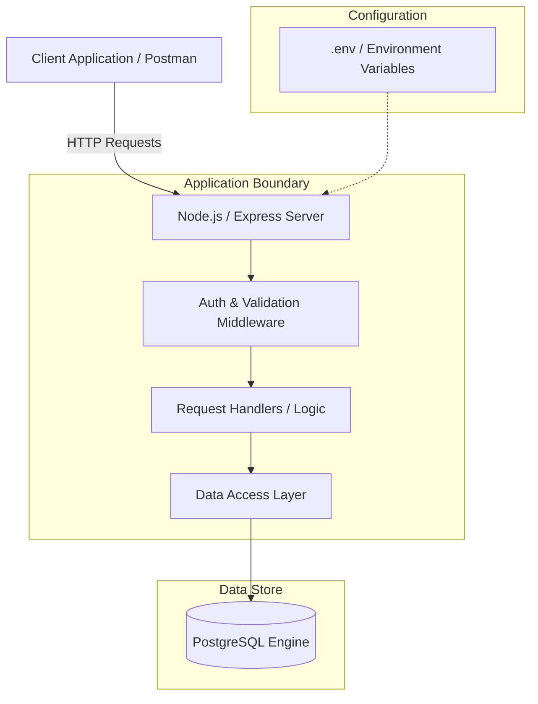

# FlyRank Widget Platform — Capstone Project

## Overview
A multi-tenant backend API for managing lead capture widgets, tenant configurations, and lead submissions built with Node.js, Express, and PostgreSQL.

## Architecture
- **API Framework**: Express.js (REST API)
- **Database**: PostgreSQL
- **Authentication**: JWT (JSON Web Tokens)
- **Environment Management**: dotenv (`.env` for secrets, `.env.example` for contract)

## Architecture Overview



## Getting Started

### Prerequisites
- Node.js (v18+)
- PostgreSQL (v14+)
- Docker & Docker Compose (optional for containerized setup)

### Installation & Setup

### Installation & Setup

1. Clone the repository:
   ```bash
   git clone https://github.com/ernestmwangombe/flyrank-capstone-widget-platform.git
   cd flyrank-capstone-widget-platform