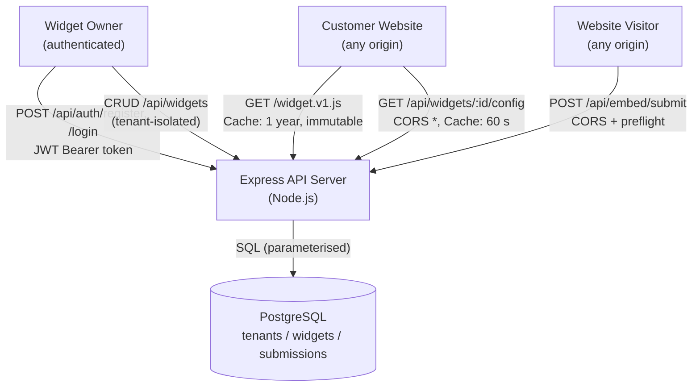

# FlyRank Capstone - Embeddable Widget & Lead-Capture Platform

A multi-tenant backend that lets a customer create an embeddable widget, hands them a one-line `<script>` snippet, and safely accepts the form submissions that come back from any website on the public internet.

Built for the FlyRank Internship Backend Track capstone with **Node.js, Express and PostgreSQL**, run with **Docker**. Everything uses free tools and needs no credit card.

> **Project status: Stages 1-4 complete.**
> Authentication, widget management, embed snippets, versioned and cached widget delivery, and the public submission endpoint are built and tested. This README describes the project as it stands after Stage 4 and is extended as each new stage is completed.

---

## What the system does

There are three kinds of people ("actors") and each has its own request path:

| Actor | What they do | Path |
|-------|--------------|------|
| **Widget owner** (tenant) | Registers, logs in, creates and manages widgets, copies the embed snippet | Authenticated API (`/api/auth/*`, `/api/widgets/*`) |
| **Customer website** | Pastes the snippet; the browser loads the script and the widget's config | Public, cached, CORS-enabled (`/widget.v1.js`, `/api/widgets/:id/config`) |
| **Website visitor** | Submits the form | Public, CORS-enabled, validated (`POST /api/embed/submit`) |

Because the public endpoints receive requests straight from browsers the server does not control, input is never trusted: every field is validated before it reaches the database, and every tenant query is filtered by the tenant id taken from a signed token.

---

## Architecture


```mermaid
flowchart TD
    Owner["Widget Owner<br/>(authenticated)"]
    Site["Customer Website<br/>(any origin)"]
    Visitor["Website Visitor<br/>(any origin)"]
    API["Express API Server<br/>(Node.js)"]
    DB[("PostgreSQL<br/>tenants / widgets / submissions")]

    Owner -- "POST /api/auth/register, /login<br/>JWT Bearer token" --> API
    Owner -- "CRUD /api/widgets<br/>(tenant-isolated)" --> API
    Site -- "GET /widget.v1.js<br/>Cache: 1 year, immutable" --> API
    Site -- "GET /api/widgets/:id/config<br/>CORS *, Cache: 60 s" --> API
    Visitor -- "POST /api/embed/submit<br/>CORS + preflight" --> API
    API -- "SQL (parameterised)" --> DB
```

The same request paths as a plain-text sketch:

```
Widget Owner --(JWT)--> Widget Management API --> widgets table (tenant_id filter) --> embed snippet

Customer Site: <script src=".../widget.v1.js?id=1">
   --> GET /widget.v1.js            (public, cached 1 year, versioned URL)
   --> GET /api/widgets/:id/config  (public, cached 60 s, CORS *)
   --> render widget

Visitor --> POST /api/embed/submit  (public, CORS)
   | validation: bad payload -> 4xx JSON
   | widget exists? no -> 404
   | store submission -> 201
```

**Code layout**

```
server.js                      App setup, auth routes, widget CRUD, widget delivery routes
db.js                          PostgreSQL connection pool
src/routes/submission.js       POST /api/embed/submit (public submission endpoint)
src/middleware/validateSubmission.js   Zod validation for submissions
schema.sql                     Tables, indexes and seed rows (run automatically on first boot)
docker-compose.yml             App + PostgreSQL services
Dockerfile                     Node 20 Alpine image for the app
test_stage_1.sh ... test_stage_4.sh    Integration test scripts, one per stage
```

---

## Quick start

### Prerequisites

- [Docker Desktop](https://www.docker.com/products/docker-desktop/) (includes Docker Compose)
- [Git](https://git-scm.com/) and a Bash shell (Git Bash on Windows is fine)
- [`jq`](https://jqlang.github.io/jq/) and `curl` (the test scripts use them)

### 1. Get the code and create your environment file

```bash
git clone https://github.com/ernestmwangombe/flyrank-capstone-widget-platform.git
cd flyrank-capstone-widget-platform
cp .env.example .env
```

Open `.env` and set `JWT_SECRET` to any long random string. Docker Compose passes it to the app, and the server refuses to start without one. `.env` is git-ignored and must never be committed.

### 2. Run (one command)

```bash
docker compose up --build
```

Wait for this line in the output:

```
Server running successfully on port 3000
```

The API is now at `http://localhost:3000`. Check it with `curl http://localhost:3000/health`.

### 3. Seed

Seeding is built into the first start. On a brand-new database volume PostgreSQL runs `schema.sql` automatically, which:

- creates the `tenants`, `widgets` and `submissions` tables and their indexes, and
- inserts demo rows: tenant `1` (`dev@flyrank.ai`) and widget `1` ("Stage 4 Public Form Widget"). The public config and submission tests use widget `1`.

To **re-seed from scratch** (this deletes all data in the database volume):

```bash
docker compose down -v
docker compose up --build -V
```

The seeded tenant has a placeholder password hash, so you cannot log in as it. To get your own demo data, register a tenant and create a widget through the API (see the examples below).

### 4. Try it

```bash
# Register a tenant
curl -X POST http://localhost:3000/api/auth/register \
  -H "Content-Type: application/json" \
  -d '{"email":"demo@example.com","password":"password123","company_name":"Demo Corp"}'

# Log in and keep the token
TOKEN=$(curl -s -X POST http://localhost:3000/api/auth/login \
  -H "Content-Type: application/json" \
  -d '{"email":"demo@example.com","password":"password123"}' | jq -r '.token')

# Create a widget; the response includes the embed_snippet
curl -X POST http://localhost:3000/api/widgets \
  -H "Content-Type: application/json" \
  -H "Authorization: Bearer $TOKEN" \
  -d '{"name":"Newsletter","type":"signup_form","config":{"title":"Subscribe","buttonText":"Join"}}'

# Submit as a visitor (no token needed)
curl -X POST http://localhost:3000/api/embed/submit \
  -H "Content-Type: application/json" \
  -d '{"widget_id":1,"data":{"email":"visitor@example.com"}}'
```

### Environment variables

| Variable | Purpose | Example |
|----------|---------|---------|
| `PORT` | HTTP port the API listens on | `3000` |
| `JWT_SECRET` | Secret used to sign login tokens (**required**) | a long random string |
| `JWT_EXPIRES_IN` | How long a login token stays valid (optional) | `1h` |
| `WIDGET_VERSION` | Current widget bundle version number (optional, default `1`) | `1` |
| `BASE_URL` | Public base URL used in embed snippets (optional, defaults to the request host) | `http://localhost:3000` |
| `DB_HOST`, `DB_PORT`, `DB_USER`, `DB_PASSWORD`, `DB_NAME` | PostgreSQL connection. `docker-compose.yml` sets these for the containers; the database is `flyrank_db`. | `postgres`, `5432`, `postgres`, `postgres`, `flyrank_db` |

---

## API reference

All errors are JSON in the form `{ "error": "message" }`. Submission validation errors add a `details` list. Unknown routes return `404`, malformed JSON bodies return `400` and oversized bodies return `413`, all as JSON rather than an HTML page.

### Authentication

Both route prefixes below work and behave identically: `/api/auth/*` and `/api/v1/admin/*`.

| Method | Endpoint | Auth | Success | Errors |
|--------|----------|------|---------|--------|
| `POST` | `/api/auth/register` | none | `201` tenant `{ id, email, company_name, created_at }` | `400` invalid or missing fields, `409` email already registered |
| `POST` | `/api/auth/login` | none | `200` `{ token, tenant }` | `400` missing fields, `401` wrong email or password |

Register rules: valid email, `company_name` 1-255 characters, password 8-72 characters. Passwords are stored as bcrypt hashes. Login returns a signed JWT (HS256) that carries only the tenant id.

### Widget management (authenticated)

Send the header `Authorization: Bearer <token>`. The tenant is always taken from the verified token, never from the request body or other headers. Each of these is also available under `/api/v1/admin/widgets`.

| Method | Endpoint | Success | Notes |
|--------|----------|---------|-------|
| `POST` | `/api/widgets` | `201` widget + `embed_snippet` | `name` required; `type` defaults to `lead_capture`; `config` must be a JSON object |
| `GET` | `/api/widgets` | `200` array of the tenant's widgets | Only the caller's widgets |
| `GET` | `/api/widgets/:id` | `200` widget + `embed_snippet` | Another tenant's widget returns `404` |
| `PUT` | `/api/widgets/:id` | `200` updated widget | Provide at least one of `name`, `type`, `config` |
| `DELETE` | `/api/widgets/:id` | `200` `{ message, id }` | Also deletes the widget's submissions (cascade) |

Common errors: `401` missing, invalid, tampered or expired token; `400` invalid id or body; `404` widget not found or belongs to another tenant.

### Public widget delivery (no auth, CORS `*`)

| Method | Endpoint | Cache-Control | Description |
|--------|----------|---------------|-------------|
| `GET` | `/widget.v1.js?id=<widget id>` | `public, max-age=31536000, immutable` | Versioned loader script. The version in the URL comes from `WIDGET_VERSION`; a new release gets a new URL, so browsers can cache forever without serving stale code. An unknown version returns `404` with `no-store`. |
| `GET` | `/widget.js?id=<widget id>` | `public, max-age=60` | Legacy unversioned URL kept so older snippets keep working; cached only briefly. |
| `GET` | `/api/widgets/:id/config` | `public, max-age=60` | Widget configuration JSON. `400` for a non-numeric id and `404` for an unknown widget, both with `no-store`. |

The embed snippet returned by the management API looks like:

```html
<script src="http://localhost:3000/widget.v1.js?id=1" defer></script>
```

### Public submission (no auth, CORS enabled)

`POST /api/embed/submit`

```json
{
  "widget_id": 1,
  "data": { "email": "visitor@example.com", "feedback": "Great platform!" },
  "metadata": { "page_url": "https://client-website.com/contact" }
}
```

- `widget_id`: positive integer (numeric strings such as `"1"` are accepted).
- `data` **or** `payload`: a non-empty JSON object holding the form fields.
- `metadata` (optional): `source_url`, `page_url` (valid URLs), `referrer`, `ip_address` (valid IPv4/IPv6).
- `OPTIONS /api/embed/submit` answers the CORS preflight with `204`.

| Status | Meaning |
|--------|---------|
| `201` | Stored. Body: `{ message, submission_id, widget_id, created_at }` |
| `400` | Validation failed (body: `{ error: "Validation Failed", details: [{ field, message }] }`) or malformed JSON (body: `{ error: "..." }`) |
| `404` | The widget does not exist |
| `413` | Body larger than the 10 KB limit (JSON error) |
| `500` | Unexpected server error (generic message; details are logged server-side only) |

### Health

`GET /health` returns `200 { "status": "ok", "timestamp": "..." }`.

---

## Testing

Each stage has an integration script. Start the app first (`docker compose up`), then in a second terminal run:

```bash
bash test_stage_1.sh   # register/login, auth rejection, CRUD, tenant isolation
bash test_stage_2.sh   # embed snippet generation
bash test_stage_3.sh   # versioned bundle, cache headers, config endpoint
bash test_stage_4.sh   # CORS preflight, submission, validation, 404, oversized payload, malformed JSON, JSON 404
```

| Script | Covers |
|--------|--------|
| `test_stage_1.sh` | Register, duplicate/short-password rejection, login, wrong password; no header, made-up Bearer string, `x-tenant-id` header and tampered token all return `401`; create/list/update/delete widget; tenant B gets `404` when reading, updating or deleting tenant A's widget and the widget is left unchanged |
| `test_stage_2.sh` | `embed_snippet` present on create and fetch, bound to the right widget id and versioned URL |
| `test_stage_3.sh` | `/widget.v1.js` status, content type and immutable cache; config endpoint headers; `400`/`404` handling; unknown version `404`; legacy URL short cache; snippet uses the versioned URL |
| `test_stage_4.sh` | Preflight `204`, valid submission `201`, missing data `400`, unknown widget `404`, oversized body `413` as JSON, malformed JSON `400` as JSON, unknown route `404` as JSON |

Raw outputs are pasted in [`EVIDENCE.md`](EVIDENCE.md). Design decisions, where AI helped and where it was wrong are in [`BUILDLOG.md`](BUILDLOG.md).

---

## Completed stages

| Stage | What was built | Verified by |
|-------|----------------|-------------|
| **1. Widget management API** | Tenant registration and login, signed JWT authentication, full widget CRUD, tenant isolation on every query | `test_stage_1.sh` |
| **2. Embed snippet generation** | Every widget response includes a ready-to-paste `<script>` embed snippet | `test_stage_2.sh` |
| **3. Fast, cached widget delivery** | Versioned widget bundle (`/widget.v1.js`, cached for a year), public config endpoint (cached for 60 s), CORS, `no-store` on error responses | `test_stage_3.sh` |
| **4. Public submission endpoint** | Cross-origin submissions with CORS and preflight, Zod input validation, widget existence check, storage in PostgreSQL, oversized-payload rejection, JSON error responses (global error handler) | `test_stage_4.sh` |

---

## Limitations

Honest notes on the current state of the project:

- **The widget UI is minimal.** The loader script shows a card with the widget's title and button. It does not collect or send form data itself; submissions are sent to `POST /api/embed/submit`.
- **Body limit is 10 KB.** It is set in `server.js` (`express.json({ limit: '10kb' })`); the `test_stage_4.sh` oversized-body check sends a larger body and expects a JSON `413`.
- **`schema.sql` is a single development script.** It drops and recreates the tables, and Docker runs it only when the database volume is new.
- **Login tokens expire** (default 1 hour). There is no refresh token, logout or password reset.
- **The seeded demo tenant cannot log in** (placeholder password hash); register a tenant to get a working account.
- **Intended for local development** with Docker Compose.
